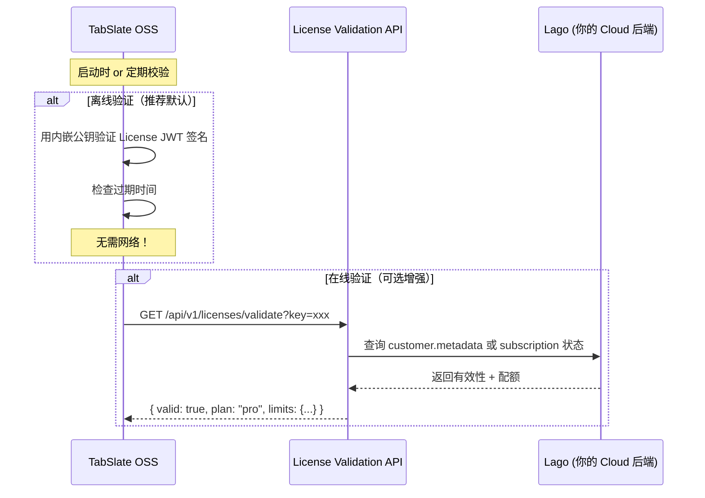

# TabSlate Server 双版本架构设计

## 核心思路

**完全可行。** Go 的 interface + dependency injection 天然适合这种插件化架构。

```
┌──────────────────────────────────────────────────┐
│             TabSlate-server (OSS)                │
│                 MIT License                      │
│                                                  │
│  ┌───────────┐  ┌───────────┐  ┌──────────────┐ │
│  │  handler/  │  │  model/   │  │  middleware/  │ │
│  │  auth.go   │  │  model.go │  │  auth.go     │ │
│  │  sync.go   │  │           │  │              │ │
│  │  ...       │  │           │  │              │ │
│  └─────┬─────┘  └───────────┘  └──────────────┘ │
│        │                                         │
│        ▼                                         │
│  ┌─────────────────────────────────────────────┐ │
│  │          billing.Provider (interface)        │ │
│  │  ─────────────────────────────────────────  │ │
│  │  GetPlanLimits(userID) → Limits             │ │
│  │  GetCheckoutURL(userID, plan) → URL         │ │
│  │  ListInvoices(userID) → []Invoice           │ │
│  │  ...                                        │ │
│  └──────────┬──────────────────┬───────────────┘ │
│             │                  │                 │
│    ┌────────▼────────┐        │                 │
│    │  local.Provider │        │  (interface     │
│    │  (License+SQLite)│        │   留给 Cloud)   │
│    └─────────────────┘        │                 │
│                               │                 │
│  cmd/server/main.go           │                 │
│  (注入 local.Provider)         │                 │
└───────────────────────────────┼─────────────────┘
                                │
                ┌───────────────▼─────────────────┐
                │      TabSlate-cloud (私有)        │
                │                                  │
                │  ┌─────────────────────────────┐ │
                │  │   lago.Provider              │ │
                │  │   (实现 billing.Provider)     │ │
                │  │   Lago API Client            │ │
                │  │   Webhook Handler            │ │
                │  └─────────────────────────────┘ │
                │                                  │
                │  cmd/server/main.go              │
                │  (导入 OSS + 注入 lago.Provider)  │
                └──────────────────────────────────┘
```

---

## 方案一：双仓库（推荐）

### 仓库结构

#### `TabSlate-server`（OSS，公开，MIT）

```
TabSlate-server/
├── cmd/server/
│   └── main.go                 # OSS 入口，注入 local provider
├── internal/
│   ├── billing/                # 🔑 核心：接口定义
│   │   ├── provider.go         # BillingProvider interface
│   │   ├── types.go            # Limits, Invoice, Subscription 等类型
│   │   └── local/              # OSS 本地实现
│   │       ├── provider.go     # 基于 License + 本地 DB 的实现
│   │       └── license.go      # License 校验逻辑
│   ├── handler/
│   │   ├── auth.go             # 注册/登录/OAuth
│   │   ├── billing.go          # 账单 API（调 BillingProvider 接口）
│   │   ├── bookmarks.go
│   │   ├── collections.go
│   │   ├── sync.go
│   │   └── workspaces.go
│   ├── model/
│   │   └── model.go
│   ├── middleware/
│   │   └── auth.go
│   └── server/
│       └── server.go           # 路由注册，接受 BillingProvider 注入
├── schema.sql
├── go.mod                      # module github.com/tabslate/server
└── LICENSE                     # MIT
```

#### `TabSlate-cloud`（私有）

```
TabSlate-cloud/
├── cmd/server/
│   └── main.go                 # Cloud 入口，注入 lago provider
├── internal/
│   └── lago/                   # Lago 实现
│       ├── provider.go         # 实现 billing.Provider 接口
│       ├── client.go           # Lago HTTP client
│       ├── customer.go         # Customer 同步
│       ├── subscription.go     # 订阅管理
│       ├── invoice.go          # 发票查询
│       ├── checkout.go         # Checkout URL
│       └── webhook.go          # Lago webhook handler
├── go.mod                      # require github.com/tabslate/server
└── go.sum
```

---

## 核心接口设计

### `billing/provider.go` — 所有版本共享的接口

```go
package billing

import "context"

// Provider 是计费系统的抽象接口。
// OSS 版本使用 local.Provider（基于 License），
// Cloud 版本使用 lago.Provider（基于 Lago API）。
type Provider interface {
    // === 用户生命周期 ===

    // OnUserCreated 在用户注册/首次 OAuth 登录时调用。
    // OSS: 无操作（用户完全本地）
    // Cloud: 推送 customer 到 Lago + 创建 free subscription
    OnUserCreated(ctx context.Context, user UserInfo) error

    // === 配额检查 ===

    // GetLimits 返回用户当前的功能配额。
    // OSS: 从 License 解析
    // Cloud: 从 Lago Entitlements 查询（带本地缓存）
    GetLimits(ctx context.Context, userID string) (*Limits, error)

    // === 订阅管理 ===

    // GetSubscription 返回用户当前的订阅状态。
    // OSS: 从 License 推断 (active license = pro/enterprise)
    // Cloud: 从 Lago 查询
    GetSubscription(ctx context.Context, userID string) (*Subscription, error)

    // GetCheckoutURL 返回升级支付页面的 URL。
    // OSS: 返回 error（OSS 不支持在线支付）或返回购买 License 的页面
    // Cloud: 调 Lago → Stripe/Adyen checkout
    GetCheckoutURL(ctx context.Context, userID string, planCode string) (string, error)

    // CancelSubscription 取消用户的订阅。
    // OSS: 返回 error
    // Cloud: 调 Lago API
    CancelSubscription(ctx context.Context, userID string) error

    // === 发票 ===

    // ListInvoices 返回用户的发票列表。
    // OSS: 返回空列表
    // Cloud: 从 Lago 查询
    ListInvoices(ctx context.Context, userID string, page, perPage int) ([]Invoice, error)
}

// WebhookHandler 是可选的 webhook 处理器。
// 只有 Cloud 版本需要实现。
type WebhookHandler interface {
    // HandleWebhook 处理来自计费系统的 webhook。
    HandleWebhook(ctx context.Context, payload []byte, signature string) error
}
```

### `billing/types.go` — 共享类型

```go
package billing

type UserInfo struct {
    ID    string
    Name  string
    Email string
}

type Plan string

const (
    PlanFree       Plan = "free"
    PlanPro        Plan = "pro"
    PlanEnterprise Plan = "enterprise"  // OSS 自托管大客户
)

type Limits struct {
    MaxWorkspaces  int  `json:"max_workspaces"`  // -1 = unlimited
    MaxBookmarks   int  `json:"max_bookmarks"`
    MaxCollections int  `json:"max_collections"`
    MaxTags        int  `json:"max_tags"`
}

type Subscription struct {
    Plan      Plan   `json:"plan"`
    Status    string `json:"status"`     // active, canceled, past_due
    ExpiresAt *int64 `json:"expires_at"` // unix timestamp, nil = never
}

type Invoice struct {
    ID        string `json:"id"`
    Amount    int    `json:"amount_cents"`
    Currency  string `json:"currency"`
    Status    string `json:"status"`
    IssuedAt  int64  `json:"issued_at"`
    PdfURL    string `json:"pdf_url,omitempty"`
}
```

---

## OSS 实现：License + 本地

### License 设计

OSS 版本的配额不通过 Lago 管理用户，而是通过 **License Key** 控制：

```
┌─────────────────────────────────────────────────────┐
│  OSS License 分两种模式（可共存）                      │
│                                                     │
│  ① 离线 License（推荐优先实现）                        │
│     - 签名的 JWT，内嵌配额信息                         │
│     - 服务端用公钥验证，无需网络                        │
│     - 适合私有部署 / 断网环境                          │
│                                                     │
│  ② 在线 License                                     │
│     - 定期调用 License API 校验有效性                  │
│     - API 后端可以是 Lago 的 customer.metadata        │
│     - 适合需要实时撤销 License 的场景                  │
└─────────────────────────────────────────────────────┘
```

#### 离线 License（JWT 签名方式）

```go
// License JWT payload 示例
{
  "iss": "tabslate",
  "sub": "license",
  "iat": 1712300000,
  "exp": 1743836000,          // 过期时间
  "plan": "pro",
  "limits": {
    "max_workspaces": -1,     // -1 = unlimited
    "max_bookmarks": -1,
    "max_collections": -1,
    "max_tags": -1
  },
  "licensee": "Acme Corp",   // 被许可方
  "fingerprint": "sha256..."  // 可选：绑定机器指纹
}
```

用你的 RSA 私钥签名，OSS 代码内嵌公钥验证。**用户无法伪造 License。**

#### `billing/local/provider.go` — OSS Provider 实现

```go
package local

import (
    "context"
    "github.com/tabslate/server/internal/billing"
)

// Provider 是 OSS 版本的 BillingProvider 实现。
// 不依赖任何外部服务，配额由 License 决定。
type Provider struct {
    license *License  // 解析后的 License，nil = 免费版
}

func New(licenseKey string, publicKey []byte) (*Provider, error) {
    var lic *License
    if licenseKey != "" {
        var err error
        lic, err = ParseAndVerify(licenseKey, publicKey)
        if err != nil {
            return nil, fmt.Errorf("invalid license: %w", err)
        }
    }
    return &Provider{license: lic}, nil
}

func (p *Provider) OnUserCreated(ctx context.Context, user billing.UserInfo) error {
    return nil // OSS: 无需同步到任何外部系统
}

func (p *Provider) GetLimits(ctx context.Context, userID string) (*billing.Limits, error) {
    if p.license != nil && p.license.Valid() {
        return &p.license.Limits, nil
    }
    // 无 License = 免费版限额
    return &billing.Limits{
        MaxWorkspaces:  1,
        MaxBookmarks:   500,
        MaxCollections: 5,
        MaxTags:        10,
    }, nil
}

func (p *Provider) GetSubscription(ctx context.Context, userID string) (*billing.Subscription, error) {
    if p.license != nil && p.license.Valid() {
        return &billing.Subscription{
            Plan:      p.license.Plan,
            Status:    "active",
            ExpiresAt: &p.license.ExpiresAt,
        }, nil
    }
    return &billing.Subscription{Plan: billing.PlanFree, Status: "active"}, nil
}

func (p *Provider) GetCheckoutURL(ctx context.Context, userID, planCode string) (string, error) {
    return "", fmt.Errorf("online checkout not available in OSS edition; visit https://tabslate.app/pricing to purchase a license")
}

func (p *Provider) CancelSubscription(ctx context.Context, userID string) error {
    return fmt.Errorf("subscription management not available in OSS edition")
}

func (p *Provider) ListInvoices(ctx context.Context, userID string, page, perPage int) ([]billing.Invoice, error) {
    return nil, nil // OSS: 无发票
}
```

### OSS `main.go`

```go
package main

import (
    "log"
    "github.com/tabslate/server/internal/billing/local"
    "github.com/tabslate/server/internal/server"
)

func main() {
    cfg := server.LoadConfig()

    // OSS: 使用本地 License Provider
    provider, err := local.New(cfg.LicenseKey, embeddedPublicKey)
    if err != nil {
        log.Fatalf("license error: %v", err)
    }

    srv := server.New(cfg, provider) // 注入 billing.Provider
    srv.Run()
}
```

---

## Cloud 实现：Lago Provider

### `TabSlate-cloud/go.mod`

```
module github.com/tabslate/cloud

go 1.25

require (
    github.com/tabslate/server v0.1.0  // 导入 OSS 作为依赖
)
```

### Cloud `main.go`

```go
package main

import (
    "log"
    "github.com/tabslate/server/internal/server"  // 导入 OSS 的 server 核心
    "github.com/tabslate/cloud/internal/lago"      // Cloud 自己的 Lago 实现
)

func main() {
    cfg := server.LoadConfig()

    // Cloud: 使用 Lago Provider
    provider, err := lago.New(lago.Config{
        BaseURL: cfg.LagoAPIURL,
        APIKey:  cfg.LagoAPIKey,
    })
    if err != nil {
        log.Fatalf("lago init error: %v", err)
    }

    srv := server.New(cfg, provider)

    // Cloud 额外注册 webhook 路由
    srv.RegisterWebhook("/webhooks/lago", provider.HandleWebhook)

    srv.Run()
}
```

### `lago/provider.go` — Cloud Provider 实现

```go
package lago

import (
    "context"
    "github.com/tabslate/server/internal/billing"
)

type Provider struct {
    client *Client
    cache  *EntitlementCache  // 本地缓存 Lago entitlements
}

func (p *Provider) OnUserCreated(ctx context.Context, user billing.UserInfo) error {
    // 推送 customer 到 Lago
    _, err := p.client.CreateCustomer(ctx, CreateCustomerRequest{
        ExternalID: user.ID,
        Email:      user.Email,
        Name:       user.Name,
    })
    if err != nil {
        return fmt.Errorf("lago create customer: %w", err)
    }

    // 创建 free subscription
    _, err = p.client.CreateSubscription(ctx, CreateSubscriptionRequest{
        ExternalCustomerID: user.ID,
        PlanCode:           "free",
    })
    return err
}

func (p *Provider) GetLimits(ctx context.Context, userID string) (*billing.Limits, error) {
    // 优先查本地缓存
    if cached, ok := p.cache.Get(userID); ok {
        return cached, nil
    }
    // 查 Lago Entitlements API
    ent, err := p.client.GetEntitlements(ctx, userID)
    if err != nil {
        return nil, err
    }
    limits := mapEntitlementsToLimits(ent)
    p.cache.Set(userID, limits)
    return limits, nil
}

func (p *Provider) GetCheckoutURL(ctx context.Context, userID, planCode string) (string, error) {
    return p.client.GenerateCheckoutURL(ctx, userID)
}

// ... 其他方法实现
```

---

## `server.go` — 核心路由（两个版本共享）

```go
package server

import (
    "github.com/gin-gonic/gin"
    "github.com/tabslate/server/internal/billing"
    "github.com/tabslate/server/internal/handler"
)

type Server struct {
    cfg      *Config
    router   *gin.Engine
    billing  billing.Provider
}

func New(cfg *Config, bp billing.Provider) *Server {
    s := &Server{cfg: cfg, billing: bp, router: gin.Default()}
    s.setupRoutes()
    return s
}

func (s *Server) setupRoutes() {
    auth := handler.NewAuthHandler(s.db, s.cfg.JWTSecret, s.billing)

    // Auth routes（两个版本都有）
    s.router.POST("/auth/register", auth.Register)
    s.router.POST("/auth/login", auth.Login)
    s.router.POST("/auth/refresh", auth.Refresh)

    // Billing routes（接口统一，行为由 Provider 决定）
    bill := handler.NewBillingHandler(s.db, s.billing)
    api := s.router.Group("/api", middleware.RequireAuth(s.cfg.JWTSecret))
    {
        api.GET("/subscription", bill.GetSubscription)
        api.GET("/limits", bill.GetLimits)
        api.POST("/checkout", bill.CreateCheckout)     // OSS: 返回购买链接; Cloud: Stripe/Adyen checkout
        api.GET("/invoices", bill.ListInvoices)         // OSS: 空列表; Cloud: Lago 发票
        api.DELETE("/subscription", bill.CancelSubscription)

        // 功能 routes（两个版本完全一致）
        api.GET("/workspaces", ...)
        api.POST("/bookmarks", ...)  // 内部调 billing.GetLimits 做配额检查
    }
}

// RegisterWebhook 让 Cloud 版本注册额外的 webhook 路由
func (s *Server) RegisterWebhook(path string, h gin.HandlerFunc) {
    s.router.POST(path, h)
}
```

---

## 两个版本的功能对比

| 功能 | OSS (TabSlate-server) | Cloud (TabSlate-cloud) |
|------|----------------------|------------------------|
| **用户注册/登录** | ✅ 本地 (密码/OAuth) | ✅ 本地 (密码/OAuth) |
| **书签/集合/工作区** | ✅ 完整功能 | ✅ 完整功能 |
| **数据同步** | ✅ 完整功能 | ✅ 完整功能 |
| **配额限制** | ✅ License 驱动 | ✅ Lago Entitlements |
| **多用户** | ✅ 本地多用户 | ✅ 多用户 |
| **在线支付** | ❌ 购买 License | ✅ Stripe/Adyen/PayPal |
| **自动续费** | ❌ License 续期 | ✅ Lago 自动 |
| **发票管理** | ❌ | ✅ Lago 发票 |
| **订阅管理** | ❌ | ✅ 升级/降级/取消 |
| **Webhook** | ❌ | ✅ Lago webhook |
| **部署依赖** | SQLite/Turso only | + Lago (PG + Redis) |
| **License 校验** | ✅ 离线 JWT / 在线 API | ❌ 不需要 |
| **开源** | ✅ MIT | ❌ 私有 |

---

## 替代方案：单仓库 + Build Tags

如果你觉得双仓库管理麻烦，Go 的 build tags 也能实现同样效果：

```
TabSlate-server/
├── cmd/server/
│   ├── main_oss.go        //go:build !cloud
│   └── main_cloud.go      //go:build cloud
├── internal/
│   ├── billing/
│   │   ├── provider.go    # interface (共享)
│   │   ├── local/         # OSS 实现 (始终编译)
│   │   └── lago/          # Cloud 实现
│   │       ├── provider_cloud.go   //go:build cloud
│   │       └── ...
```

```bash
# 构建 OSS 版本
go build -o tabslate-oss ./cmd/server/

# 构建 Cloud 版本
go build -tags cloud -o tabslate-cloud ./cmd/server/
```

### 双仓库 vs Build Tags 对比

| | 双仓库 | Build Tags |
|---|---|---|
| **代码隔离** | ✅ 物理隔离，Cloud 代码完全不在公开仓库 | ⚠️ 同仓库，需要确保 Cloud 代码不在 OSS 分支 |
| **依赖管理** | Cloud 用 `go.mod` 引用 OSS | 单个 go.mod |
| **CI/CD** | 各自独立 pipeline | 条件构建 |
| **开源友好** | ✅ OSS 仓库干净，无商业代码痕迹 | ⚠️ 会看到 `//go:build cloud` 的文件名 |
| **维护成本** | 🟡 两个仓库的版本同步 | 🟢 单仓库简单 |

> [!TIP]
> **推荐双仓库。** 对于开源项目来说，保持 OSS 仓库的纯净非常重要。用户 clone 下来看到一堆 `cloud` tag 的文件会觉得困惑。双仓库更符合 Gitea、MinIO、GitLab 等成功项目的做法。

---

## License 后端校验与 Lago 的关系

你提到 "License 的后端校验也可以放在 Lago"。具体实现方式：



**License 验证 API** 可以是一个：
- 你的 Cloud 后端上的简单端点
- 独立的轻量级 License 服务
- 甚至直接查 Lago 的 customer metadata（Lago customer 的 `metadata` 字段可以存 license 信息）

OSS 版本只需要知道一个 API URL，不需要了解 Lago 的存在。

---

## 开放问题

> [!IMPORTANT]
> 确认以下几点后我就可以开始写完整的实现计划和代码：

1. **仓库策略**：倾向**双仓库**还是 **Build Tags**？（我推荐双仓库）

2. **OSS License 模式**：
   - **A) 离线优先** — JWT 签名 License，无需网络，启动时验证一次。适合大多数自托管场景
   - **B) 在线优先** — 每次启动/定期调 API 验证。可实时撤销 License，但需要网络
   - **C) 两种都支持** — 默认离线，配了 API URL 就走在线
   - 推荐 C

3. **是否可以 proceed**？确认后我会创建完整的 implementation plan + task list，然后开始写代码
